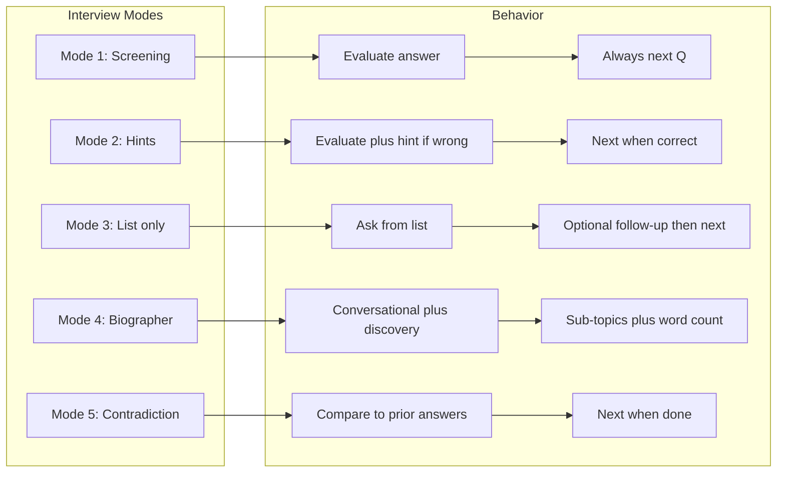

# Interview Modes and Templates

Plan: Add five per-question interview modes (from strict screening to biographer to political fact-check) and saved interview templates so the app supports screening, tech, behavioral, biography, and contradiction-checking interviews—with mode switching between questions in the same interview.

---

## Agent architecture

The interviewer is **always agentic**: one agent loop for all modes. Mode only changes which tools are available and how the system prompt constrains behavior. This keeps a single code path and one place to add or audit tools.

- **Single control flow:** Each turn: receive message + context → agent may call tools (mode-dependent) → agent returns next reply and `questionCovered`.
- **Mode = configuration:** Mode selects (1) which tools are in scope and (2) the system prompt. Screening is “agent with one tool and a strict prompt”; biography is “agent with full tool set and open-ended prompt.”
- **Extensibility:** New modes or tools = new tool registrations and prompt rules; no second pipeline.

### Mode → tool set + prompt

| Mode | Tools available | Prompt constraint |
|------|-----------------|-------------------|
| **1** | `check-answer` only | After user responds you must call check-answer. If correct → short acknowledgment and move on. If incorrect → say “That’s not quite right” and move on. Do not skip the tool or improvise. |
| **2** | `check-answer` only | After user responds you must call check-answer. If correct → acknowledge and move on. If incorrect → reply with the hint from the tool and do not advance. Do not skip the tool or improvise. |
| **3** | (none, or read-only question list) | Ask only from the question list. After they answer, optionally ask the single follow-up if defined, then move on. No content-based follow-ups. |
| **4** | `discover-entities`, `assemble-timeline`, `assemble-family-tree`, `analyze-wordcount` (optional), `suggest-follow-ups` | Warm, conversational biographer. Use tools to update timeline/family and to choose the next question (themes, recurring characters, coverage). List of questions is invisible to the subject. |
| **5** | `review-for-contradiction` | Conversational but direct. After user responds, call review-for-contradiction; if contradictions exist, gently surface and ask for clarification. Otherwise acknowledge and move on. |

**Screening (1–2) reliability:** The agent is constrained to one tool and a fixed response pattern, so behavior is deterministic and auditable. Log “check-answer was called with X and returned Y” for HR.

**Session start (all modes):** Optional tool `review-historical` (when persistence exists) runs at session start; input = prior sessions + question checklist, output = briefing so the interviewer has context.

---

## Current state (post-implementation)

- **Data**: `Question` has `mainQuestion`, `subTopics[]`, `wordCountThreshold`, `mode`, `acceptableAnswers`, `followUpPrompt`, `correctReply`, `incorrectReply`. **InterviewTemplate** has optional intro, conclusion, reminder. **Position**, **Interview instance**, and **Session** types and persistence are in place (see [requirements.md](requirements.md)). Supabase optional for positions, custom templates, instances, sessions.
- **Chat**: Mode-specific branching (1–5); check-answer for 1 & 2, list-only with optional follow-up for 3, discovery + sub-topics for 4, review-for-contradiction for 5. Intro/conclusion and disengagement reminder supported. Next question appended when moving on (modes 1–3).
- **Config**: Edits questions, mode, acceptable answers, follow-up, correctReply/incorrectReply. Templates UI: start from template, save as template.
- **Flow**: Client sends questions, currentQuestionIndex, coveredSubTopics, discoveryContext, userRepliesForCurrentQuestion, intro, conclusion, reminder, reminderAlreadyShown; persistence (instances, sessions) and resume with review-historical.
- **Admin**: Create position at `/admin/positions/new` (JD upload, use template, or from scratch). Position detail at `/admin/positions/[id]` (view/edit/delete). Template detail at `/admin/templates/[id]` (view-only for built-in; view/edit/delete for custom). See [requirements.md](requirements.md) for full admin routes and API.

---

## 1. Types and data model

- Add `InterviewMode` type: `1 | 2 | 3 | 4 | 5`.
- Extend **Question**: `mode`, `acceptableAnswers?` (mode 1 & 2), `followUpPrompt?` (mode 2 & 3).
- Add **InterviewTemplate**: `id`, `name`, `questions`.
- **constants/templates.ts**: Three built-in templates (ice cream shop, internship screening, biography 70yo); helpers getTemplateById, getDefaultTemplate.

---

## 2. Chat logic by mode (pre-agent refactor)

Until the agent loop is implemented, chat continues to branch by mode: mode 1 evaluate and always advance; mode 2 evaluate and hint or advance; mode 3 list-only and optional follow-up; mode 4 discovery + sub-topics + word threshold; mode 5 contradiction check. Answer comparison via `evaluateAnswer` for 1 & 2.

---

## 3. Config UI

- Per-question mode selector (1–5).
- When mode 1 or 2: Acceptable answers (textarea, one per line).
- When mode 2 or 3: Follow-up prompt (optional).
- New questions default to mode 4.

---

## 4. Templates UI

- “Start from template” dropdown: Empty + built-in + custom (localStorage).
- On select: load questions and open Config.
- “Save as template” to add custom template.

---

## 5. Wire new fields

- API and client pass `questions` (with mode, acceptableAnswers, followUpPrompt), and for mode 3 `userRepliesForCurrentQuestion`.

---

## 6. Optional

- Word count button only when any question is mode 3 or 4.
- Discovery viewer only populated when discovery runs (mode 4/5).

---

## Implementation order (suggested)

1. Types, templates, Config, Templates UI, wire fields (current plan — done).
2. Persistence (interview id, sessions, messages) and **review-historical** at session start.
3. Refactor to **always agentic**: one interviewer agent; mode → tool set + prompt; **check-answer** formalized for 1 & 2.
4. **review-for-contradiction** for mode 5.
5. Mode 4 tools: discover-entities, assemble-timeline, assemble-family-tree, suggest-follow-ups, optional analyze-wordcount.

---

## Mermaid: high-level flow by mode (pre-agent)

---

## Summary

- **Types**: InterviewMode 1–5, Question.mode, acceptableAnswers, followUpPrompt; InterviewTemplate; built-in and custom templates.
- **Chat**: Mode-specific behavior; after refactor, single agent loop with mode → tool set + prompt.
- **Agent**: One interviewer agent for all modes; screening constrained by single tool and strict prompt; biography and contradiction get full or dedicated tool sets.
