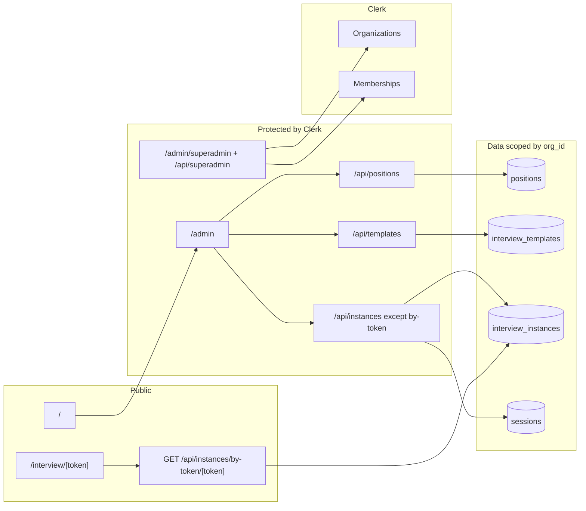

# Multi-tenant app plan

Historical reference: plan for introducing multi-tenancy with **Clerk Organizations** and in-app **superadmin** org/member management.

---

## Decisions

- **Orgs:** Use **Clerk Organizations only**. No `orgs` table in Supabase; Clerk is the source of truth for org list and user–org membership.
- **Superadmin:** All superadmin actions (create/edit/delete orgs, move users, add/remove members, view as org) are done **in-app** via Clerk Backend API. No need to log into the Clerk Dashboard.

---

## Current state (summary)

- **Auth:** Clerk protects `/admin(.*)` and `/api/templates(.*)`, `/api/positions(.*)`, `/api/instances(.*)` in `middleware.ts`. API handlers use `auth()` and return 401 when no `userId`; `userId` is not yet used for data scoping.
- **Data:** `supabase/schema.sql` has `positions`, `interview_templates`, `interview_instances`, `sessions` with no `org_id`. All Supabase queries are unscoped.
- **Public:** `/` is landing (no login). `/interview/[token]` calls `GET /api/instances/by-token/[token]`, which is currently protected — must be fixed so candidates can load the interview without logging in.
- **Templates:** Built-in in `constants/templates.ts`; custom in Supabase `interview_templates` with no org.

---

## 1. Public vs protected surface

**Public (no login):**

- **Landing:** Keep `/`; optionally add `/about`, `/pricing` placeholders.
- **Interview by link:** Keep `/interview/[token]` public. Exclude `GET /api/instances/by-token/[token]` from middleware protection so it is callable without auth.

**Protected (Clerk required):**

- All of `/admin` and `/api/templates`, `/api/positions`, `/api/instances` except `by-token` stay protected.

---

## 2. Org model and auth (Clerk Organizations)

- Each tenant is one **Clerk Organization** (e.g. "Acme Corp").
- Users can belong to **multiple orgs**; **active org** (`auth().orgId`) is the tenant context for admin and APIs.
- Enable Organizations in Clerk Dashboard. Post-sign-up: require user to create or join an org (e.g. "force organizations" or redirect to org creation/selection).
- **Resolving orgId:**
  - **Normal admin:** `orgId = auth().orgId`. Require active org when accessing admin/APIs; redirect or prompt to create/join if missing.
  - **Superadmin:** Identify via Clerk `publicMetadata.superadmin === true` or env list of user IDs. Allow **override**: "View as org" dropdown sets effective org (cookie or header); APIs use this override when present.

**No Supabase org tables** — Clerk is the only source of truth for orgs and memberships.

---

## 3. Schema and data scoping

**Supabase schema (`supabase/schema.sql`):**

- **positions:** Add `org_id TEXT NOT NULL`, index `(org_id)`.
- **interview_templates:** Add `org_id TEXT` (nullable). `NULL` = standard/shared; non-null = org custom.
- **interview_instances:** Add `org_id TEXT NOT NULL`, index `(org_id)`.
- **sessions:** No change (access via instance; instances are org-scoped).

**Templates:** Standard = built-in in code or DB rows with `org_id IS NULL`. Custom = `org_id = current_org`. List = standard + custom for current org.

**Lib and API:** All position/template/instance functions take `orgId`; filter/validate by `org_id`. by-token stays unscoped by org. Types: add `orgId`/`org_id` to relevant records.

---

## 4. Admin (org-scoped) behavior

- Show Clerk `<OrganizationSwitcher />` in admin so users with multiple orgs can switch.
- All admin data (positions, templates, instances) filtered by current `orgId`.

---

## 5. Superadmin (in-app via Clerk Backend API)

All of the following are done **in the app**; superadmin never needs to log into Clerk Dashboard.

**Detection:** Superadmin if `auth().user?.publicMetadata?.superadmin === true` or `userId` in env list (e.g. `SUPERADMIN_USER_IDS`).

**View as org:** Dropdown to set effective org (cookie `superadmin_viewing_org` or header `X-Viewing-Org`). APIs use this instead of `auth().orgId` when caller is superadmin and override is set.

**Org management (Clerk Backend SDK, server-side only):**

- **Create org:** `clerkClient.organizations.createOrganization({ name, slug, createdBy })`
- **Update org:** `clerkClient.organizations.updateOrganization(orgId, { name, slug, ... })`
- **Delete org:** Clerk Backend API for delete organization (if available); otherwise document that deletion is via Clerk Dashboard or add when Clerk supports it.
- **List orgs:** Clerk Backend API list organizations — used for "View as org" dropdown and superadmin org list page.

**Membership management (Clerk Backend SDK):**

- **Add user to org:** `clerkClient.organizations.createOrganizationMembership({ organizationId, userId, role })`
- **Remove user from org:** `clerkClient.organizations.deleteOrganizationMembership(organizationId, userId)`
- **Update role:** `clerkClient.organizations.updateOrganizationMembership(organizationId, userId, { role })`
- **Move user:** Remove from org A, add to org B (two API calls). Users can belong to multiple orgs by adding multiple memberships.
- **List members:** Clerk Backend API list organization members — for superadmin "users in this org" view.

**Implementation:** Superadmin-only API routes (e.g. under `/api/superadmin/orgs`, `/api/superadmin/orgs/[id]/members`) that (1) verify current user is superadmin, (2) call Clerk Backend SDK with server secret key. Superadmin UI pages under e.g. `/admin/superadmin` (or `/superadmin`) protected by same middleware; page checks superadmin and shows org list, org detail, member list, add/remove/move user, create/rename org.

---

## 6. Implementation order

1. **Public by-token:** Exclude `/api/instances/by-token` from middleware protection.
2. **Schema migration:** Add `org_id` to positions, interview_templates, interview_instances; backfill if needed.
3. **Clerk:** Enable Organizations; post-sign-up create/join org flow.
4. **Auth helper:** `getEffectiveOrgId(auth(), request)` — Clerk orgId + superadmin override from cookie/header.
5. **Resolve org in APIs:** Use helper in every protected route; pass `orgId` into lib; return 403 if org required but missing.
6. **Lib + types:** Add `orgId` to all Supabase/lib calls and types; scope queries and inserts.
7. **Admin UI:** OrganizationSwitcher; handle "no org" state.
8. **Superadmin override:** "View as org" dropdown + cookie/header; APIs read override when user is superadmin.
9. **Standard templates:** List = standard (code or `org_id IS NULL`) + org custom; update template API.
10. **Superadmin org management:** Pages and API routes for list orgs, create/update org, list members, add/remove/update membership (move users between orgs). All via Clerk Backend SDK.
11. **Optional:** `/about`, `/pricing` placeholders.

---

## 7. Files to touch

| Area | Files |
|------|--------|
| Middleware | `middleware.ts` (exclude by-token) |
| Schema | `supabase/schema.sql` (org_id, indexes) |
| Types | `types/index.ts` (orgId on records) |
| Lib | `lib/server/supabasePositions.ts`, `lib/server/supabaseTemplates.ts`, `lib/server/supabaseInstanceStore.ts`, `lib/server/instanceStoreAdapter.ts` |
| API | All protected routes: resolve orgId, pass to lib; add `lib/auth/getEffectiveOrgId` or equivalent |
| Admin UI | Header or admin layout: OrganizationSwitcher; superadmin "View as org" dropdown |
| Superadmin | New routes: `app/api/superadmin/orgs/`, `app/api/superadmin/orgs/[id]/members`, etc.; `app/admin/superadmin/` pages (org list, org detail with members, create/rename org, add/remove/move user) |
| Optional | `app/about/page.tsx`, `app/pricing/page.tsx` |

---

## 8. Diagram (high-level)

